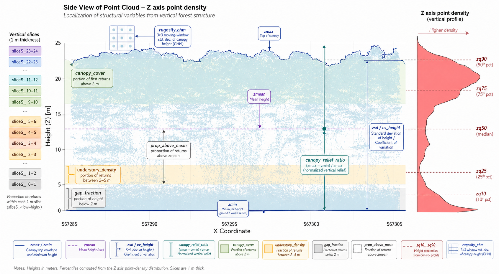

## Included Forest Strucutre Metrics Overview

*Figure 1. Schematic of LiDAR‑derived vertical forest structure metrics. Layout drafted with assistance from the AI tool “Perplexity, powered by GPT‑5.1” and finalized by the authors.*

Table 1. Description of the included LiDAR-derived forest structure metrics.
| Variable name | Human‑readable name | Meaning / use | Computed with function | Package |
| --- | --- | --- | --- | --- |
| `cv_height` | Height coefficient of variation | Measures the relative spread of return heights within a pixel; indicates local vertical heterogeneity and canopy structural complexity. | `sd(Z, na.rm = TRUE) / mean(Z, na.rm = TRUE)` inside `compute_forest_metrics()` | `lidR` (via `pixel_metrics()`) |
| `canopy_cover` | Canopy cover | Proportion of returns above the canopy height threshold (e.g., 2 m) in each pixel; used to distinguish open vs closed canopy and as a proxy for canopy density. | `sum(Z > ht) / length(Z)` inside `compute_forest_metrics()` | `lidR` (via `pixel_metrics()`) |
| `gap_fraction` | Gap fraction | Complement of canopy cover (1 − canopy cover); indicates the fraction of the pixel area without above‑threshold returns, highlighting canopy gaps and sparse patches. | `1 - canopy_cover` inside `compute_forest_metrics()` | `lidR` (via `pixel_metrics()`) |
| `canopy_relief_ratio` | Canopy relief ratio | Describes where the mean return height lies within the pixel height range; high values indicate relatively tall canopies, low values indicate bottom‑heavy structure. | `(zmean − zmin) / (zmax − zmin)` inside `compute_forest_metrics()` | `lidR` (via `pixel_metrics()`) |
| `understory_density` | Understory density | Proportion of canopy returns between the canopy threshold and an upper understory limit (e.g., 2–5 m) among all canopy returns; characterizes lower‑canopy filling and recruitment structure. | `sum(Z > ht & Z < ut) / sum(Z > ht)` inside `compute_forest_metrics()` | `lidR` (via `pixel_metrics()`) |
| `zmax` | Maximum height | Highest return elevation in the pixel after height normalization; approximates local canopy top height for each pixel. | `stdmetrics_z(Z)` (output `zmax`) inside `compute_forest_metrics()` | `lidR` (via `pixel_metrics()`) |
| `zmean` | Mean height | Average height of all returns in the pixel; summarizes the central tendency of the vertical profile and is widely used in biomass and structure models. | `stdmetrics_z(Z)` (output `zmean`) inside `compute_forest_metrics()` | `lidR` (via `pixel_metrics()`) |
| `zsd` | Height standard deviation | Standard deviation of return heights in the pixel; quantifies vertical spread and complexity of the canopy profile. | `stdmetrics_z(Z)` (output `zsd`) inside `compute_forest_metrics()` | `lidR` (via `pixel_metrics()`) |
| `zmin` | Minimum height | Lowest return elevation in the pixel after normalization; reflects near‑ground occupancy and local height range. | `stdmetrics_z(Z)` (output `zmin`) inside `compute_forest_metrics()` | `lidR` (via `pixel_metrics()`) |
| `zq*` (e.g., `zq10`, `zq90`, etc.) | Height quantiles | Quantile‑based height metrics (e.g., 10th, 25th, 50th, 75th, 90th percentile) describing the vertical distribution of returns; useful for feature engineering and model input layers. | `stdmetrics_z(Z)` (various `zq*` outputs) inside `compute_forest_metrics()` | `lidR` (via `pixel_metrics()`) |
| `rugosity_chm` | CHM rugosity | Local standard deviation of a 3×3 m window on the canopy height model; indicates local roughness and multi‑layered canopy structure. | `terra::focal(chm_terra, fun = sd, na.rm = TRUE)` on output of `grid_canopy(..., algorithm = p2r())` | `lidR` (for CHM), `terra` (for focal SD and resampling) |
| `prop_above_mean` | Proportion of returns above mean tile height | Fraction of tile‑level tree returns lying above the overall mean tree height; characterizes vertical skew toward taller vegetation and can be used for tile‑level stratification. | `sum(Z_all > mean(Z_all)) / length(Z_all)` written into a constant raster via `terra::rast()` and `terra::values()` | `lidR` (for `Z_all` extraction), `terra` (for raster layer creation) |
| `sliceS_<low-high>` | Species structure slice layer | Encodes species-labeled (S=species code number) tree occupancy for one vertical height interval (in 1-m steps); useful for reconstructing the vertical distribution of species within the stand. | Height filtering with `filter_poi()`, polygon construction with `concaveman()`, rasterization with `rasterize()` | Height filtering with `lidR`, polygon construction with `concaveman`, rasterization with `terra` |
